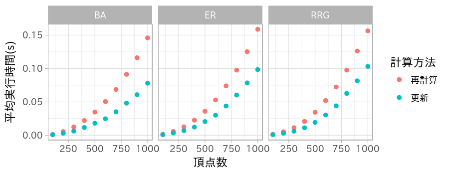
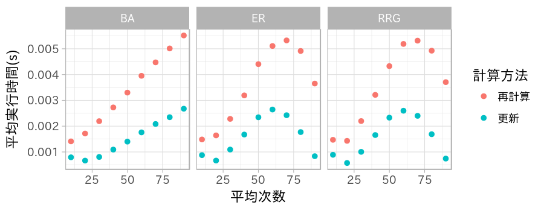
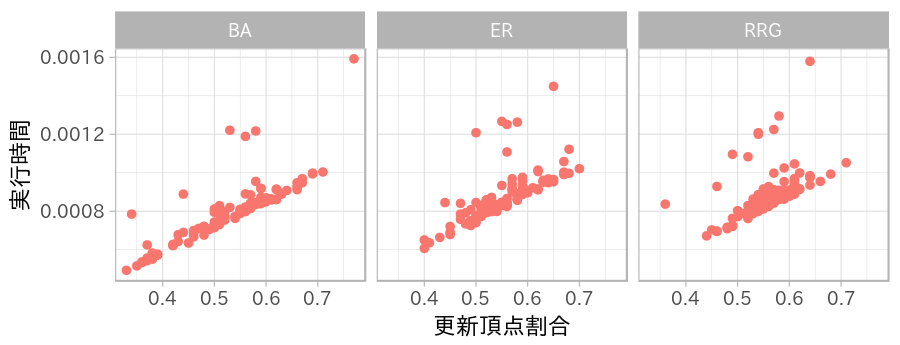

研究進捗報告
================
里谷 佳紀
平成30年4月24日

# 研究全体の目的

グラフと全頂点間距離と最短経路の数およびペア依存度が与えられたとき，グラフの辺が削除されたとする．
このときの全頂点間距離と最短経路の数とペア依存度を高速に更新する方法を開発する．
また，実験と理論の両方から既存の方法と比較することで，新方法の有用性を検証する．

# 前回打ち合わせ時に定めた短期目標

1.  電子情報通信学会の原稿執筆
2.  一辺削除時の全頂点の媒介中心性の更新の実験

# 本日までの進捗状況

1.  ほぼ完成した．
2.  実験を行った．結果を次の節で示す．

# 一辺削除時の全頂点の媒介中心性の更新の実験

今回は，一辺削除時の全頂点の媒介中心性の更新に関する実験を行った． 次の二方法を比較した．

1.  再計算：グラフから辺を削除し，すべての頂点の媒介中心性を再計算する方法
2.  更新：辺\(e=\{\alpha,\beta\}\)が削除されるとき，\(d_{v\alpha}\neq d_{v\beta}\)
    なる頂点\(v\)のペア依存度の更新のみを行う方法

次の三種のネットワークに対して実験を行った．

1.  BA：Barabási–Albertモデル
2.  ER：Erdős–Rényiモデル
3.  RRG：ランダム正則グラフ

## 頂点数と実行時間

次数を10で固定し，頂点数を変化させたときの二つのアルゴリズムの 実行時間を示す．結果から，更新を行う方法が有効であると言える．

## 次数と実行時間

頂点数を100で固定し，次数を変化させたときの二つのアルゴリズムの 実行時間を示す．結果から，BAネットワークでは平均次数が高くなれば計算時間が
長くなるが，ERネットワークとRRGではそうならないことが言える．

## 頂点数と次数と実行時間比

頂点数と次数と実行時間比(更新の実行時間を再計算の実行時間で割ったもの)
の平均の関係を示す．結果から，最良で2割程度の計算時間で媒介中心性を更新できる
ことが分かる．

## 再計算された頂点の割合と実行時間

頂点数が100,平均次数が10のとき，ペア依存度が更新された頂点の割合 （更新頂点割合）と実行時間の関係を示す．結果から，これらの量には
正の相関関係があると言える．

