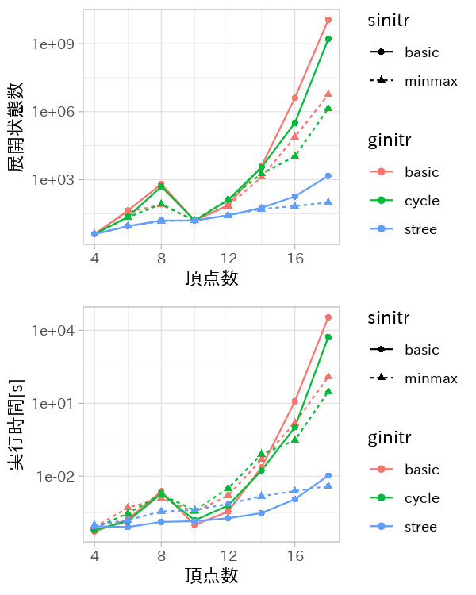

研究進捗報告
================
里谷 佳紀
平成30年5月22日


# 研究全体の目的

グラフと全頂点間距離と最短経路の数およびペア依存度が与えられたとき，グラフの辺が削除されたとする．
このときの全頂点間距離と最短経路の数とペア依存度を高速に更新する方法を開発する．
また，実験と理論の両方から既存の方法と比較することで，新方法の有用性を検証する．

# 前回打ち合わせ時に定めた短期目標

1.  電子情報通信学会の発表スライドの作成
2.  アルゴリズムごとのデータの整理

# 本日までの進捗状況

1.  着手している．発表の流れを決め，いくつかのスライドを作成した．
2.  次節で説明する．

# 各アルゴリズムの比較

昨年度，初期グラフと枝刈りの有無を変えて実験した．その結果を示す．

``` r
data_url = paste0('https://raw.githubusercontent.com/y-satotani/gmg-finder/',
                  'master/docs/res/data/the-cmp-algo-lab.csv')
data <- read_csv(data_url) %>%
  filter(sorted == 'basic', sinitr %in% c('basic', 'minmax')) %>%
  group_by(n, d, ginitr, sinitr) %>%
  summarise(n_state = mean(n_state), time = mean(time))
```

``` r
# 次数3
qs <- ggplot(data %>% filter(d == 3),
  aes(n, n_state, colour = ginitr, linetype = sinitr, shape = sinitr)) +
  geom_line() + geom_point() +
  labs(x = '頂点数', y = '展開状態数') +
  scale_y_log10()
qt <- ggplot(data %>% filter(d == 3),
aes(n, time, colour = ginitr, linetype = sinitr, shape = sinitr)) +
  geom_line() + geom_point() +
  labs(x = '頂点数', y = '実行時間[s]') +
  scale_y_log10()
grid.arrange(qs, qt, ncol = 1)
```



``` r
# 次数4
qs <- ggplot(data %>% filter(d == 4),
  aes(n, n_state, colour = ginitr, linetype = sinitr, shape = sinitr)) +
  geom_line() + geom_point() +
  labs(x = '頂点数', y = '展開状態数') +
  scale_y_log10()
qt <- ggplot(data %>% filter(d == 4),
aes(n, time, colour = ginitr, linetype = sinitr, shape = sinitr)) +
  geom_line() + geom_point() +
  labs(x = '頂点数', y = '実行時間[s]') +
  scale_y_log10()
grid.arrange(qs, qt, ncol = 1)
```


