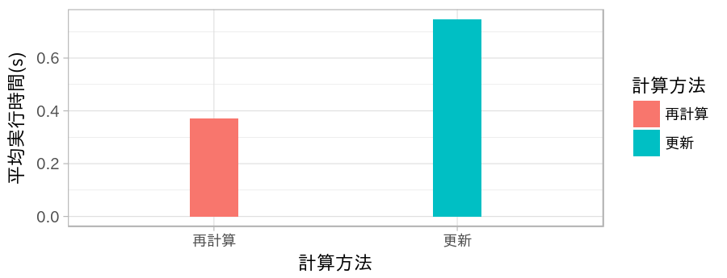
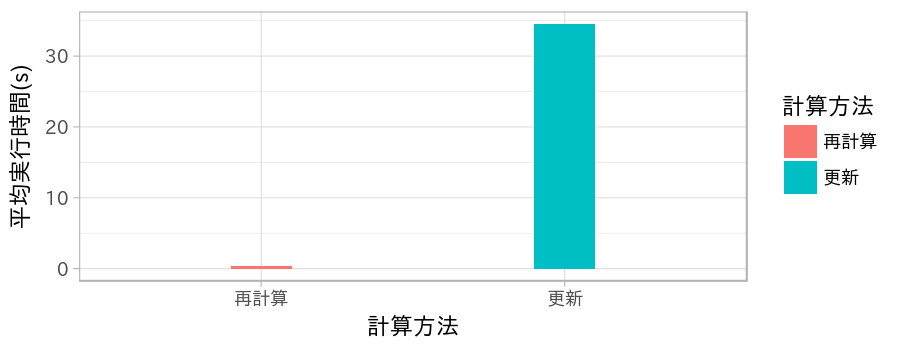

研究進捗報告
================
里谷 佳紀
平成30年7月17日

# 研究全体の目的

グラフと全頂点間距離と最短経路の数およびペア依存度が与えられたとき，グラフの辺が削除されたとする．
このときの全頂点間距離と最短経路の数とペア依存度を高速に更新する方法を開発する．
また，実験と理論の両方から既存の方法と比較することで，新方法の有用性を検証する．

# 前回打ち合わせ時に定めた短期目標

1.  文書化
2.  実データを用いた実験

# 本日までの進捗状況

1.  2.の実験結果を文書に追加した．
2.  小規模な道路ネットワークでの実験が完了した．

# 実ネットワークの媒介中心性の更新の実験

次の二方法を比較した．

1.  再計算：グラフから辺を挿入/削除し，すべての頂点の媒介中心性を再計算する方法
2.  更新：辺\(e=\{\alpha,\beta\}\)が挿入/削除されるとき，\(d_{v\alpha}\neq d_{v\beta}\)なる頂点\(v\)のペア依存度の更新のみを行う方法

ここで，挿入/削除対象の辺はランダムに定められる．

ネットワークは2270頂点，2663辺を有する．

## 挿入時

一辺挿入時の二つのアルゴリズムの実行時間の100回の平均を示す．結果から，最初から計算する方が有効であると言える．

## 削除時

一辺削除時の二つのアルゴリズムの実行時間の100回の平均を示す．結果から，最初から計算する方が有効であると言える．

