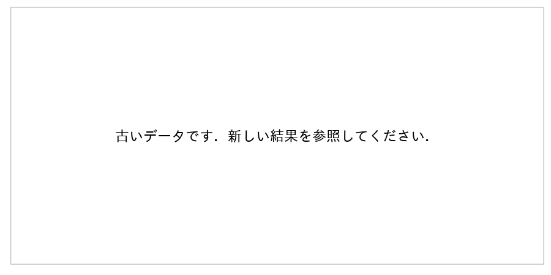
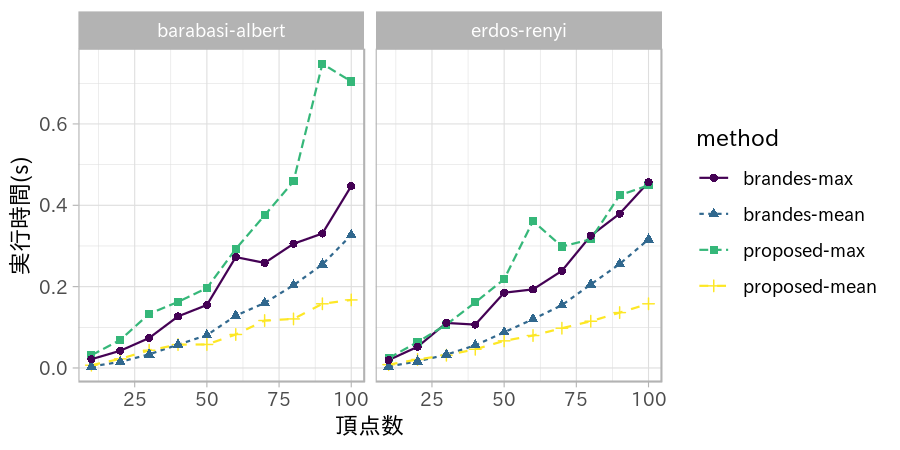

研究進捗報告
================
里谷 佳紀
平成30年11月22日

# 研究全体の目的

グラフと全頂点間距離と最短経路の数およびペア依存度が与えられたとき，グラフの辺が削除されたとする．
このときの全頂点間距離と最短経路の数とペア依存度を高速に更新する方法を開発する．
また，実験と理論の両方から既存の方法と比較することで，新方法の有用性を検証する．

# 前回打ち合わせ時に定めた短期目標

1.  媒介中心性を更新するアルゴリズムの設計
2.  最短経路更新に関する論文の解説の準備

# 本日までの進捗状況

1.  挿入・削除両方のアルゴリズムの設計が完了した．実験の結果を以下に示す．媒介中心性の誤差はたかだか\(10^{-12}\)である．
2.  未着手

# 一辺削除時の全頂点の媒介中心性の更新の実験

一辺挿入および削除時の全頂点の媒介中心性の更新に関する実験を行った．

## 一辺挿入時の実験結果

一辺挿入操作に対して，次数を4に固定し頂点数を変化させたときの実行時間を示す．
図は2個のグラフで構成され，それぞれBarabási–Albertモデル，Erdős–Rényiモデルで行った結果であることを意味する．4本の線はそれぞれBrandesのアルゴリズムの実行時間の最大値および平均値，提案手法の実行時間の最大値および平均値を表す．

## 一辺削除時の実験結果

挿入時の実験と同じ設定で削除操作に対する実行時間を示す．

