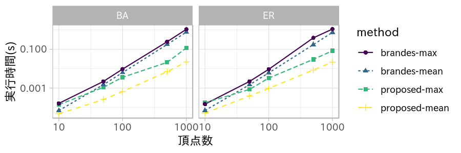
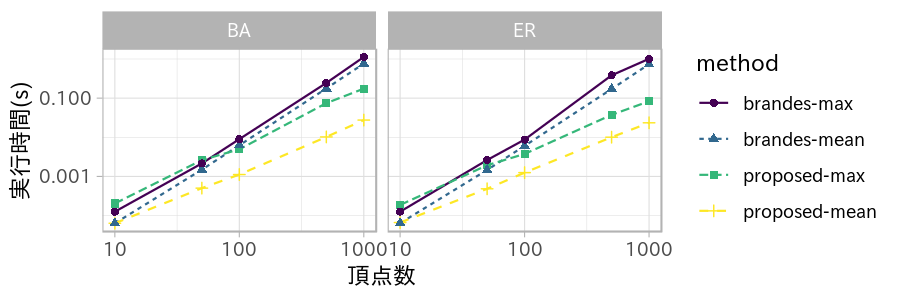

研究進捗報告
================
里谷 佳紀
2019年6月28日

# 研究全体の目的

グラフと全頂点間距離と最短経路の数およびペア依存度が与えられたとき，グラフの辺が削除されたとする．
このときの全頂点間距離と最短経路の数とペア依存度を高速に更新する方法を開発する．
また，実験と理論の両方から既存の方法と比較することで，新方法の有用性を検証する．

# 前回打ち合わせ時に定めた短期目標

1.  挿入・削除時に距離と最短経路数が変化するための条件に関する文書の執筆
2.  プログラムの再実装
3.  実データの収集

# 本日までの進捗状況

1.  アルゴリズムを文書に写した．
2.  アルゴリズムの再実装が完了し，簡単な実験を行った．結果を以下に示す．
3.  データセットを公開しているサイトを調査した．

<!-- end list -->

  - Stanford Large Network Dataset Collection
      - <http://snap.stanford.edu/data/index.html>
      - 確認した論文のうち約半数に使われている
      - 辺操作を伴うグラフも存在するが，挿入操作しかなく有向グラフである
  - SocioPatterns
      - <http://www.sociopatterns.org/datasets/>
      - 人の交流を赤外線センサーによって集めたデータセット
      - 辺挿入・削除の両方の操作がネットワークに施される
  - LASAGNE(Laboratory of Algorithms, modelS, and Analysis of Graphs and
    NEtworks)
      - <http://www.pilucrescenzi.it/lasagne/content/networks.html>
      - 調べた中で数少ない電子回路のネットワークがある
  - The Koblenz Network Collection
      - <http://konect.uni-koblenz.de/>
      - カテゴリが多く，生態学からソフトウェアまで扱う

# 一辺削除時の全頂点の媒介中心性の更新の実験

一辺挿入および削除時の全頂点の媒介中心性の更新に関する実験を行った．

## 一辺挿入時の実験結果

一辺挿入操作に対して，次数を4に固定し頂点数を変化させたときの実行時間を示す．
図は2個のグラフで構成され，それぞれBarabási–Albertモデル，Erdős–Rényiモデルで行った結果であることを意味する．
4本の線はそれぞれBrandesのアルゴリズムの実行時間の最大値および平均値，提案手法の実行時間の最大値および平均値を表す．

## 一辺削除時の実験結果

挿入時の実験と同じ設定で削除操作に対する実行時間を示す．

