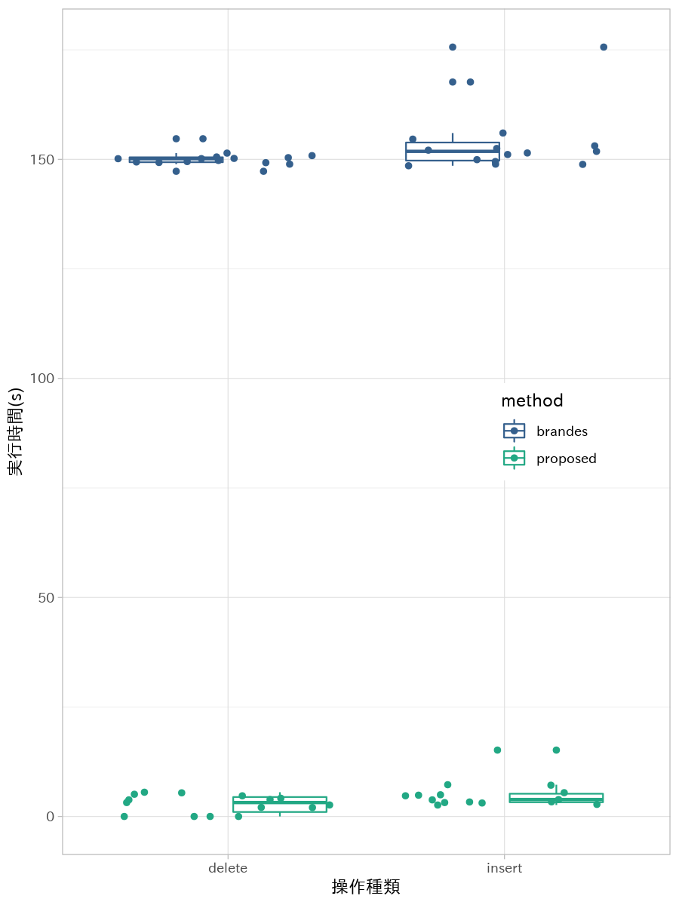

研究進捗報告
================
里谷 佳紀
2019年7月5日

# 研究全体の目的

グラフと全頂点間距離と最短経路の数およびペア依存度が与えられたとき，グラフの辺が削除されたとする．
このときの全頂点間距離と最短経路の数とペア依存度を高速に更新する方法を開発する．
また，実験と理論の両方から既存の方法と比較することで，新方法の有用性を検証する．

# 前回打ち合わせ時に定めた短期目標

1.  修士論文の下書きの執筆
2.  実データに対する実験

# 本日までの進捗状況

1.  章の構成を見直した．
2.  データセット`ca-HepPh`に対する実験を行った．

# `ca-HepPh`に対する実験

`SNAP`から取得した`ca-HepPh`を対象に実験を行った．

  - ネットワークは，12008頂点，118521辺を有する．
  - 重みなし無向ネットワークなので，すべての辺の重みを1とした．
  - 挿入/削除を，対象の辺を変えてそれぞれを15回ずつ行った．
  - 挿入する辺の重みは1とした．

| method   | mode   | MaxErr   |     Min |  Median |    Mean |     Max |
| :------- | :----- | :------- | ------: | ------: | ------: | ------: |
| brandes  | delete | NA       | 147.279 | 150.150 | 150.123 | 154.709 |
| brandes  | insert | NA       | 148.539 | 151.830 | 154.114 | 175.629 |
| proposed | delete | 5.82e-10 |   0.014 |   3.186 |   2.843 |   5.546 |
| proposed | insert | 5.12e-09 |   2.625 |   3.873 |   5.038 |  15.161 |

