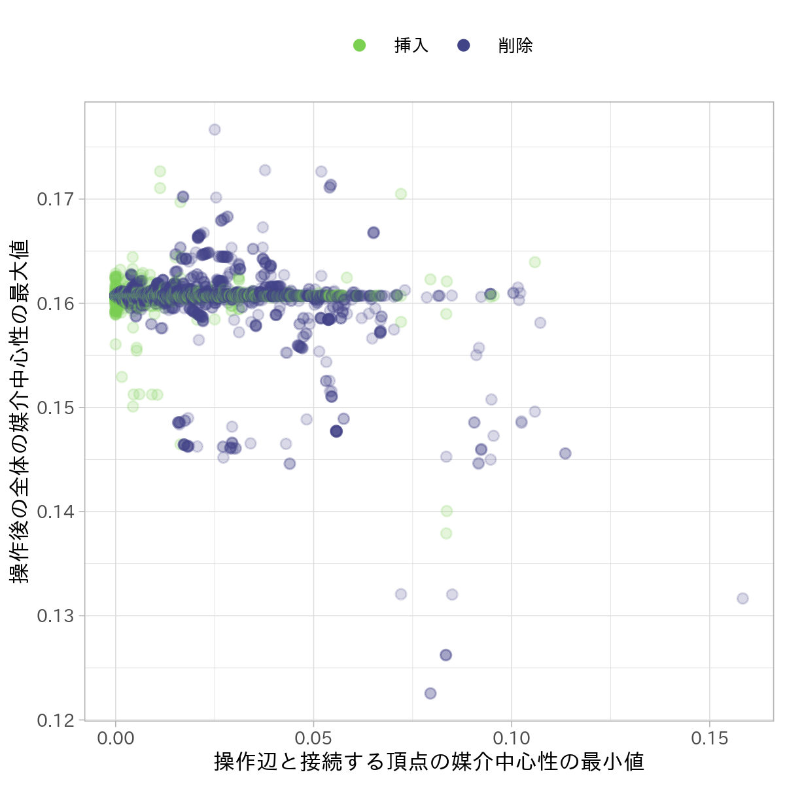

研究進捗報告
================
里谷 佳紀
2019年10月25日

# 研究全体の目的

グラフと全頂点間距離と最短経路の数および依存度が与えられたとき，グラフの辺が削除されたとする．
このときの全頂点間距離と最短経路の数と依存度を高速に更新する方法を開発する．
また，実験と理論の両方から既存の方法と比較することで，新方法の有用性を検証する．

# 前回打ち合わせ時に定めた短期目標

1.  修士論文の執筆
2.  道路ネットワークの実験の続き

# 本日までの進捗状況

1.  未着手
2.  実験が完了した．結果を以下に示す．

<!-- end list -->

    ## Warning: Removed 1500 rows containing missing values (geom_point).

