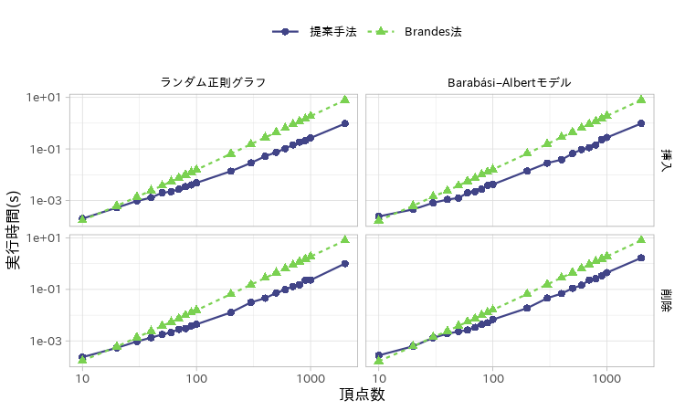

研究進捗報告
================
里谷 佳紀
2019年12月20日

# 研究全体の目的

グラフと全頂点間距離と最短経路の数および依存度が与えられたとき，グラフの辺が削除されたとする．
このときの全頂点間距離と最短経路の数と依存度を高速に更新する方法を開発する．
また，実験と理論の両方から既存の方法と比較することで，新方法の有用性を検証する．

# 前回打ち合わせ時に定めた短期目標

1.  修士論文の執筆
2.  投稿論文の執筆
3.  Bergaminiらの方法に基づく新たなアルゴリズムの実験

# 本日までの進捗状況

1.  進捗はありません．
2.  実験結果のグラフに対してコメントをいただいた．現在，このコメントを反映するために グラフ描画プログラムを作成している．
3.  人工ネットワークに対する実験が完了した．結果を以下に示す．

# 実験結果

## 頂点数と実行時間の関係

次数が\(4\)のネットワークを頂点数，各ネットワークトポロジについて\(10\)個生成し，
それらに辺をランダムに挿入/削除した．この操作を\(100\)試行繰り返し，
都合\(1000\)試行の実行時間の平均値をプロットした． 今後はBrandes法との実行時間の比を計算する．

## 影響を受ける頂点の数と実行時間の関係

まずは記号を説明する．
頂点集合\(V\)に対して，\(|V|\)は頂点集合の要素数，\(\|V\|\)は\(V\)に属する頂点と接続する辺の数を表す．

\(T(x)\)および\(S(x)\)はそれぞれ\(x\)への，および，\(x\)からの最短経路が操作の影響を受ける 頂点の集合である．挿入時は
\[T(x)=\{t|t\in V\land d_{xt}\geq d_{xu}+l'_{uv}+d_{vt}\}\]
\[S(x)=\{s|s\in V\land d_{sx}\geq d_{su}+l'_{uv}+d_{vx}\}\] で，削除時は
\[T(x)=\{t|t\in V\land d_{xt}=d_{xu}+l_{uv}+d_{vt}\}\]
\[S(x)=\{s|s\in V\land d_{sx}=d_{su}+l_{uv}+d_{vx}\}\] である．
これらをもとに，影響を受ける頂点の平均値\(\bar{A}\)を定義する．
\[\bar{A}=\frac{\sum_{s\in S(v)}|T(s)|+\sum_{t\in T(u)|S(t)}}{|S(v)|+|T(u)|}.\]

媒介中心性更新時にアルゴリズムが走査した頂点の数に関する記号を定義する．
\(\tau(s)\)と\(\tau'(s)\)は，媒介中心性を減少/増加させるアルゴリズムが走査した頂点の集合である．
具体的には， \[\tau(s)=T(s)\cup\{x|\Delta_{s\bullet}(x)>0\}\]
\[\tau'(s)=T(s)\cup\{x|\Delta'_{s\bullet}(x)>0\}\] である．
媒介中心性を更新するためにアルゴリズムが走査した頂点の集合を
\(\hat{\tau}=\bigcup_{s\in S(v)}\tau(s)\)で， 操作によって実際に媒介中心性が変化した頂点の集合を
\(\tau^\ast=\{x|B_x\neq B'_x\}\) で示す．

それぞれの実験で，頂点数が\(1000\)，次数\(k\)が\(4\)のランダム正則グラフを10個生成し，
それらのグラフについて，挿入/削除操作を\(100\)試行繰り返した．

### 最短経路更新アルゴリズム

アルゴリズムの計算量は，重み付きグラフと重みなしグラフでそれぞれ
\[\mathcal{O}(\sum_{s\in S(v)}(\|T(s)\|\log|T(s)|)+\sum_{t\in T(u)}(\|S(t)\|\log|S(t)|)),\]
\[\mathcal{O}(\sum_{s\in S(v)}\|T(s)\|+\sum_{t\in T(u)}\|S(t)\|)\] である．

### 媒介中心性更新アルゴリズム

アルゴリズムの時間計算量は，重み付きグラフと重みなしグラフでそれぞれ
\[\mathcal{O}(\sum_{s\in S(v)}\left(\left\|\tau(s)\right\|+\left|\tau(s)\right|\log\left|\tau(s)\right|\right)),\]
\[\mathcal{O}(\sum_{s\in S(v)}\left\|\tau(s)\right\|)\] である．

## アルゴリズムが走査した頂点の数と媒介中心性が変化した頂点の数の関係

アルゴリズムの性質上，媒介中心性が変化しない頂点も走査対象になりうる． そのような頂点はできるだけ少ない方がアルゴリズムの効率は良いと言える．
そこで，媒介中心性が変化した頂点の数\(|\tau^\ast|\)と
アルゴリズムが走査した頂点の数\(|\hat{\tau}|\)を比較することで，
アルゴリズムが効率よく更新できるトポロジを考察する．

各トポロジの頂点数は\(1000\)で，平均次数は\(4\)として実験を行った．
さらに，\(|\hat{\tau}|/|\tau^\ast|\)が最大の試行について， 原点とその試行の点を結ぶ直線を引いた．

